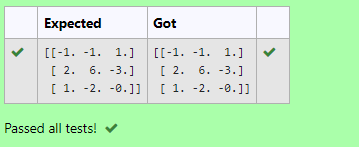

# INVERSE-OF-A-MATRIX
## Aim:
To write a python program to find the inverse of a matrix
## Equipment’s required:
1. 	Hardware – PCs
2. 	Anaconda – Python 3.7 Installation / Moodle-Code Runner

## Algorithm:
## Step1 :
Start the program.

## Step 2:
Import numpy module as np

## Step 3:
assign the given values to the variables.

## Step 4:
End the program.

## Program:

~~~

Program to find the inverse of a matrix.
Developed by:Sarankumar J 
RegisterNumber:21500780

import numpy as np
A=np.array([[6,2,3],[3,1,1],[10,3,4]])
s=np.linalg.inv(A)
print(s)

~~~

## Output:

## Result:
The inverse of given matrix is successfully solved using python program

